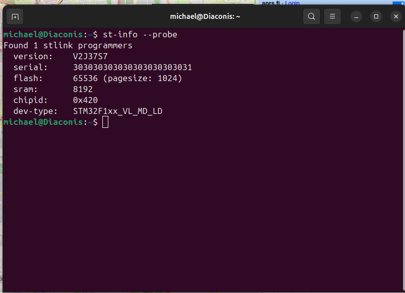
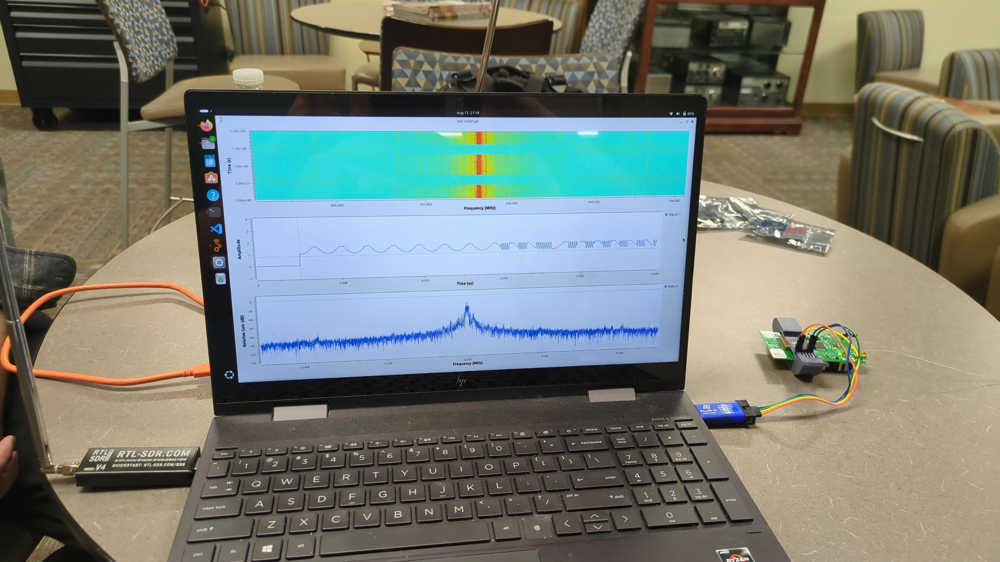
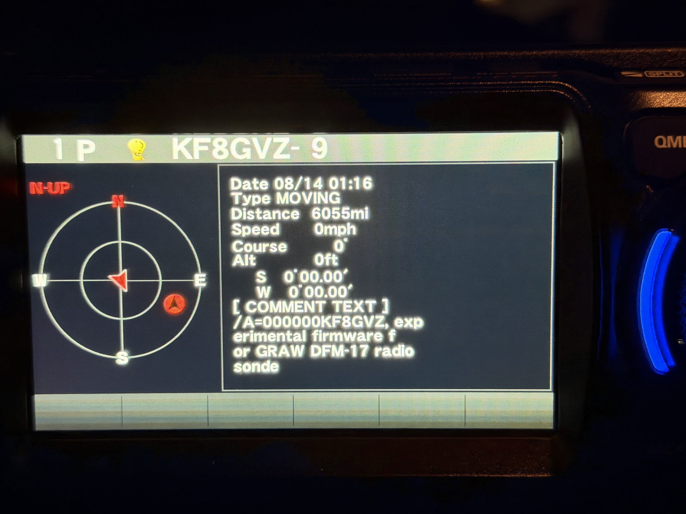

# Graw DFM-17 Programming Breakout Clip (Balloon Jockey)

## Preface
A radiosonde is the active data collecting payload of a weather balloon, recording temperature, pressure and its own GNSS tracked position and transmitting this to receivers on the ground. These balloons and their radiosondes are launched two times a day in many states by US National Weather Service stations to help improve weather forecasting models. They often fly up to 35 Kilometers (or 115,000 feet), their balloons popping when they reach their pressure limit, at which point they float down with the assistance of a parachute. They can then be collected and kept as the NWS does not request that these devices be returned, only disposed of responsibly (this information is printed on every radiosonde launched). 

The Graw DFM-17 is one of the most commonly launched models of radiosonde in the US. Unlike the Viasala RS41 (another common model), the programming interface of the DFM-17 is difficult to utilize. Both these devices use a STM32 based microcontroller to execute the data collection and transmission logic, and both are programmable via a Single Wire Debug (SWD) port, but the DFM-17 lacks pins or a hardware connector to interface with, instead only having unpopulated fine pitch solder pads. These pads are delicate, and require a steady hand and keen eye to solder wires onto.

## Purpose
This project was created to ease functional re-use of GRAW DFM-17 Radiosondes by providing an easily attachable SWD port breakout, providing clear labeling and allowing one to use Dupont style cables to connect an ST-Link Programmer. It uses a pair of spring connectors positioned to clamp down on top of these small contacts. 

## Usage
<figure style="text-align: center;">
  
</figure>

To interface with the DFM-17, You need to use a compatible ST-Link programmer device. The software to use this programmer in windows is [STM32CubeProgrammer](https://www.st.com/en/development-tools/stm32cubeprog.html#get-software), which should include the necessary drivers. Alternatively, In windows, you may install ST-Link drivers separately. [These can be found here](https://www.st.com/en/development-tools/stsw-link009.html). Once drivers are installed, Open Windows Device Manager to confirm the device appears under Universal Serial Bus devices. 

If you are using linux you may simply install ```stlink-tools``` via the package manager. Ubuntu/Debian: ```sudo apt install stlink-tools```

Dissassembling the DFM-17 Radiosonde is easy. You must remove the zip-tie and the front sticker, and then the styrofoam shell comes apart and you can access the main board. The batteries are non-rechargable and can be disposed of, they may already be fully discharged after the radiosonde has flown once.
<br>
<figure style="text-align: center;">
  
  <figcaption>
    With the clip open, position it against the top of the battery housing on the sondes main board.
    </figcaption>
</figure>

<br>
<figure style="text-align: center;">
  
    <figcaption>
    Rest the edge of the board closest to the ublox module into the small notch on the clip opposite the hinge side. The sonde should now be able to rest flat in the clip. 
    </figcaption>
</figure>

<br>
<figure style="text-align: center;">
  
    <figcaption>
    With the board positioned this way, it should ensure that the spring contacts on the breakout board and the sondes main board will be properly aligned. Now close the clip over the board and secure it using the catch. 
    </figcaption>
</figure>
 
<br>
<figure style="text-align: center;">
  
    <figcaption>
    Using the ST Link, wire up to the breakout according to the pin labels. You must connect the 3.3v power to the Vcc pin.
    </figcaption>
</figure>

<br>
<figure style="text-align: center;">
  
</figure>


<figure style="text-align: center;">
    
    <figcaption>
    Once you have connected your ST Link to the breakout, and your ST Link to your PC, you can verify that the connection is working properly by pulling the chip id and device type with a probe. if the connection is working properly, you should see the STM32F1XX device type and 0x420 chip id. 
    </figcaption>
</figure>
<br>

## Recommended Resources
[RS41ng](https://github.com/mikaelnousiainen/RS41ng) is a popular and successful project aimed at creating alternate firmwares for radiosondes, including the Graw DFM-17.
<br>
<figure style="text-align: center;">
    
    
    <figcaption>
    Here I have used RS41ng to generate an APRS transmitter firmware for the DFM-17, and after flashing it to the device, I am verifying with a receiver that it is transmitting correctly.
    </figcaption>
</figure>


[Documentation License: CC-BY-SA-4.0](./images/docs%20license.md)